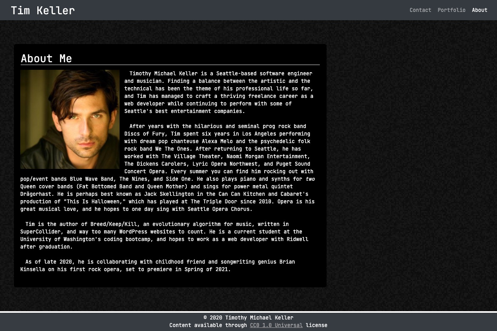

# React Portfolio

## Table of Contents
1. [Description](#description)
2. [Installation](#installation)
3. [Technologies](#technologies)
4. [Usage](#usage)
5. [Contributing](#contributing)
6. [Tests](#tests)
7. [Questions](#questions)
8. [License](#license)
## Description
A refactoring of my simple HTML/CSS portfolio to use React.js, React router, and best practices for modern front-end technologies.

## Installation
Clone from github into your chosen directory, type npm i to install all dependencies, then npm start to start the site on your localhost. Default port is 3000.

## Technologies
Written with React.js and React router.

## Usage
Simple front-end site. Navigate with the top nav bar. Site should be responsive and look good on all devices.

[Live Site URL](https://tmk-react-portfolio.herokuapp.com/)

## Contributing
I mean, if you really wanna contribute to my portfolio site, I won't fight you. Email me at timothy.m.keller@gmail.com

## Tests
No test suites are designated.

## Questions
Written by [tmkeller](https://github.com/tmkeller) on Github.
Email the author at timothy.m.keller@gmail.com.

## License
[Apache 2.0 License](https://opensource.org/licenses/Apache-2.0)